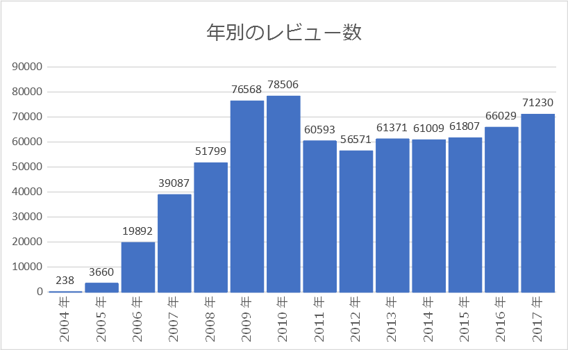
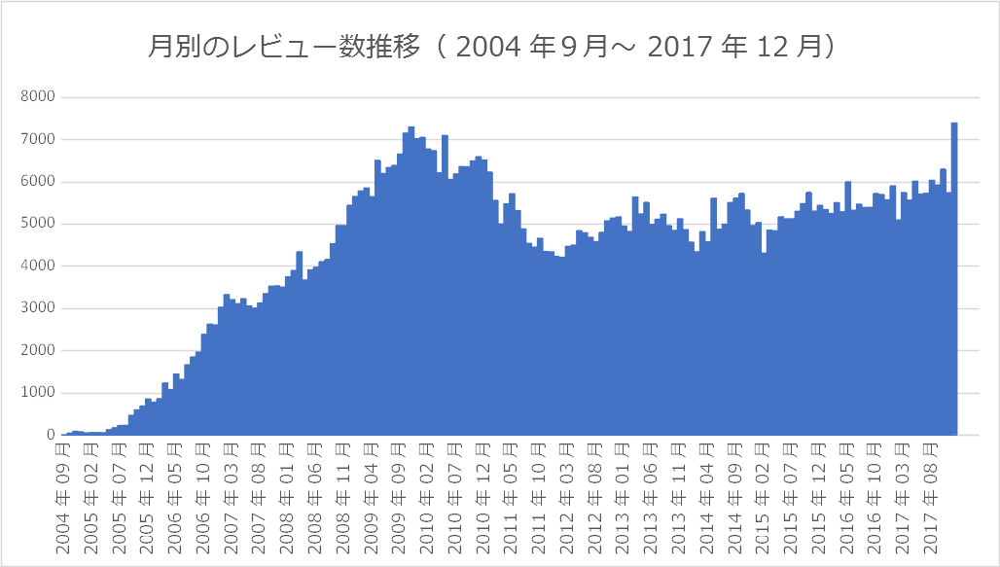
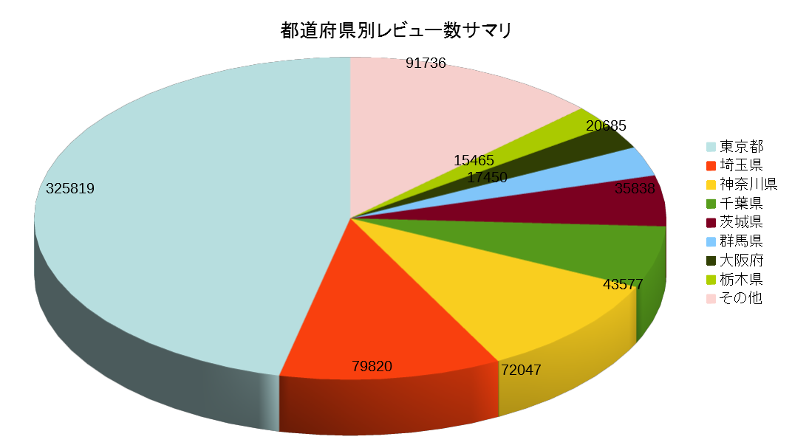
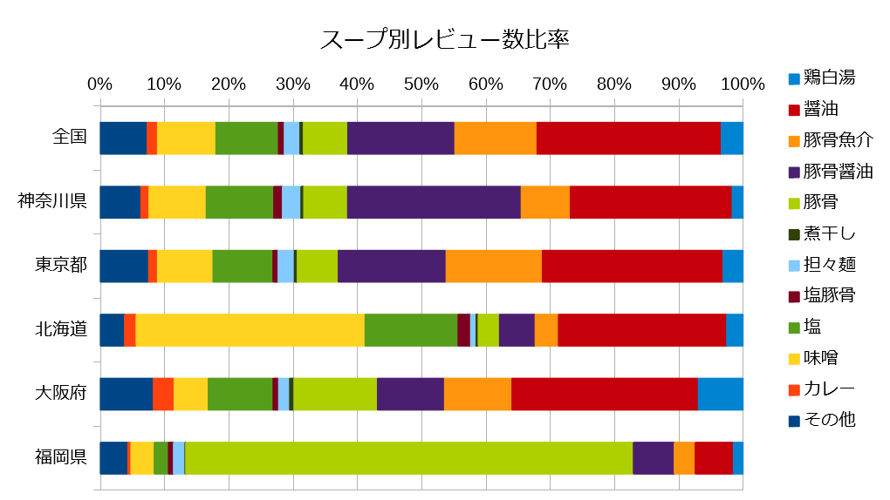
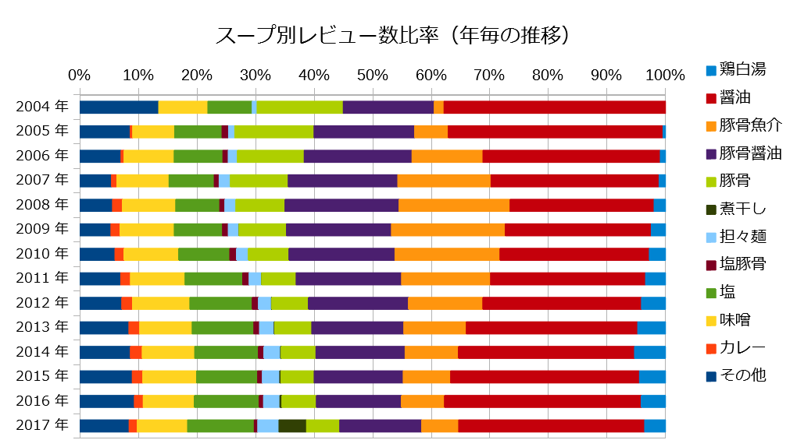
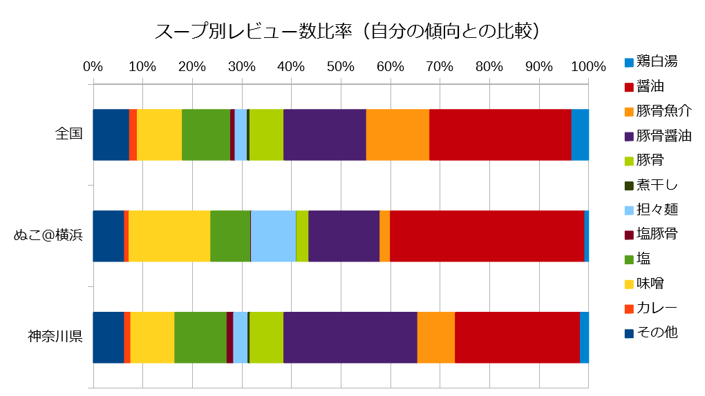

# ラーメンデータベースレポート 1

2018年3月下旬時点で収集したラーメンデータベースの情報を元に、ごく簡単な分析を行った内容を示す。

## 目次

[TOC]

## 時系列で見たレビュー数

### 年単位

### 月単位

------

### 都道府県別のレビュー数

ラーメンデータベース開設から2017年末日までに登録されたレビュー数を都道府県別に集計した。

サマリのグラフはこれ。

以下、各都道府県別の詳細を示す。

| 都道府県 | レビュー数 | 都道府県 | レビュー数 | 都道府県 | レビュー数 |
| -------- | ---------: | -------- | ---------: | -------- | ---------: |
| 東京都   |     325819 | 新潟県   |       4281 | 秋田県   |        749 |
| 埼玉県   |      79820 | 静岡県   |       3881 | 奈良県   |        746 |
| 神奈川県 |      72047 | 兵庫県   |       3662 | 三重県   |        636 |
| 千葉県   |      43577 | 岐阜県   |       2718 | 和歌山県 |        491 |
| 茨城県   |      35838 | 広島県   |       2418 | 福井県   |        473 |
| 群馬県   |      20685 | 富山県   |       2401 | 海外     |        458 |
| 大阪府   |      17450 | 山形県   |       2238 | 徳島県   |        451 |
| 栃木県   |      15465 | 岩手県   |       1555 | 鹿児島県 |        409 |
| 愛知県   |       9714 | 青森県   |       1482 | 大分県   |        388 |
| 長野県   |       8844 | 石川県   |       1476 | 宮崎県   |        385 |
| 北海道   |       6890 | 沖縄県   |       1268 | 佐賀県   |        345 |
| 京都府   |       6302 | 滋賀県   |       1115 | 高知県   |        293 |
| 福島県   |       6234 | 山口県   |        958 | 香川県   |        273 |
| 山梨県   |       5431 | 熊本県   |        817 | 鳥取県   |        246 |
| 福岡県   |       5117 | 愛媛県   |        792 | 長崎県   |        239 |
| 宮城県   |       4662 | 岡山県   |        753 | 島根県   |        145 |

2017年末までにラーメンデータベースに登録されたレビュー数の総数は、708360件。このうち東京都のレビュー数は実に46％を占めている。レビュー数の多寡は、その地域におけるレビューアのアクティビティを示すものになる。やはり首都圏・大都市圏の都道府県のレビュー数は高くなる。

レビュー数1位の東京都と、レビュー数48位の島根県のレビュー数比は2000倍を超えており、地方でのラーメンデータベース上の情報量不足が顕著に現れている。こうした地方では、ラーメンデータベースよりは食べログ等の総合グルメレビューサイトを使うことが多いからなのだろう。

### 都道府県別のレビュー店舗数

| 都道府県 | レビュー済店舗数 | 都道府県 | レビュー済店舗数 | 都道府県 | レビュー済店舗数 |
| -------- | ---------------: | -------- | ---------------: | -------- | ---------------: |
| 東京都   |            15670 | 京都府   |              948 | 愛媛県   |              217 |
| 神奈川県 |             6021 | 新潟県   |              874 | 三重県   |              215 |
| 埼玉県   |             3884 | 山形県   |              696 | 秋田県   |              208 |
| 千葉県   |             3216 | 山梨県   |              653 | 奈良県   |              171 |
| 大阪府   |             2849 | 広島県   |              604 | 大分県   |              169 |
| 茨城県   |             1976 | 岩手県   |              550 | 和歌山県 |              130 |
| 北海道   |             1872 | 山口県   |              511 | 鹿児島県 |              129 |
| 群馬県   |             1792 | 岐阜県   |              483 | 宮崎県   |              128 |
| 愛知県   |             1783 | 富山県   |              462 | 佐賀県   |              128 |
| 栃木県   |             1700 | 青森県   |              416 | 福井県   |              118 |
| 長野県   |             1399 | 石川県   |              350 | 鳥取県   |              118 |
| 福岡県   |             1196 | 沖縄県   |              346 | 高知県   |              108 |
| 福島県   |             1068 | 海外     |              322 | 徳島県   |              106 |
| 静岡県   |             1063 | 滋賀県   |              280 | 香川県   |               94 |
| 兵庫県   |              963 | 熊本県   |              238 | 長崎県   |               87 |
| 宮城県   |              954 | 岡山県   |              220 | 島根県   |               71 |

### レビュー数と店舗数比率

| 都道府県 | レビュー数/店舗数 | 都道府県 | レビュー数/店舗数 | 都道府県 | レビュー数/店舗数 |
| -------- | ----------------: | -------- | ----------------: | -------- | ----------------: |
| 東京都   |             20.79 | 宮城県   |              4.89 | 熊本県   |              3.43 |
| 埼玉県   |             20.55 | 奈良県   |              4.36 | 岡山県   |              3.42 |
| 茨城県   |             18.14 | 福岡県   |              4.28 | 山形県   |              3.22 |
| 千葉県   |             13.55 | 徳島県   |              4.25 | 鹿児島県 |              3.17 |
| 神奈川県 |             11.97 | 石川県   |              4.22 | 宮崎県   |              3.01 |
| 群馬県   |             11.54 | 福井県   |              4.01 | 三重県   |              2.96 |
| 栃木県   |              9.10 | 広島県   |              4.00 | 香川県   |              2.90 |
| 山梨県   |              8.32 | 滋賀県   |              3.98 | 岩手県   |              2.83 |
| 京都府   |              6.65 | 兵庫県   |              3.80 | 長崎県   |              2.75 |
| 長野県   |              6.32 | 和歌山県 |              3.78 | 高知県   |              2.71 |
| 大阪府   |              6.12 | 北海道   |              3.68 | 佐賀県   |              2.70 |
| 福島県   |              5.84 | 沖縄県   |              3.66 | 大分県   |              2.30 |
| 岐阜県   |              5.63 | 静岡県   |              3.65 | 鳥取県   |              2.08 |
| 愛知県   |              5.45 | 愛媛県   |              3.65 | 島根県   |              2.04 |
| 富山県   |              5.20 | 秋田県   |              3.60 | 山口県   |              1.87 |
| 新潟県   |              4.90 | 青森県   |              3.56 | 海外     |              1.42 |

人気のある店は何回もレビューされるため、レビューアが通いやすいかつ人気のある店が多い首都圏では、この比率が高くなりやすい。都道府県規模の割に茨城県の比率が高いのは面白い。これは、茨城県に熱心な信者をもつ店舗が多いからなのかもしれない。

逆に、海外や大都市圏を持たない都道府県のように、そもそも行くこと自体の障壁が高い場合には、この比率はかなり低くなる。

### おまけ：神奈川県内に限定したレビュー数

神奈川県内の市区郡別に登録されたレビュー数を示す。なお、**町田は神奈川**なので、町田市も含めて集計している。

| 市区郡名       | レビュー数 | 市区郡名         | レビュー数 | 市区郡名     | レビュー数 |
| -------------- | ---------: | ---------------- | ---------: | ------------ | ---------: |
| 横浜市中区     |       6632 | 横須賀市         |       1401 | 川崎市宮前区 |        446 |
| 横浜市神奈川区 |       6456 | 横浜市都筑区     |       1367 | 座間市       |        439 |
| 町田市         |       5629 | 横浜市保土ヶ谷区 |       1252 | 横浜市瀬谷区 |        423 |
| 相模原市中央区 |       4002 | 川崎市幸区       |       1168 | 足柄下郡     |        402 |
| 横浜市西区     |       3973 | 横浜市青葉区     |       1147 | 川崎市麻生区 |        365 |
| 横浜市港北区   |       3839 | 茅ヶ崎市         |       1106 | 横浜市泉区   |        322 |
| 川崎市川崎区   |       3823 | 横浜市緑区       |       1084 | 横浜市栄区   |        261 |
| 川崎市中原区   |       3282 | 横浜市磯子区     |       1080 | 伊勢原市     |        240 |
| 藤沢市         |       3028 | 平塚市           |       1060 | 高座郡       |        231 |
| 横浜市鶴見区   |       2265 | 海老名市         |       1059 | 綾瀬市       |        226 |
| 厚木市         |       2228 | 鎌倉市           |        975 | 愛甲郡       |        152 |
| 大和市         |       2204 | 相模原市緑区     |        911 | 足柄上郡     |        149 |
| 横浜市港南区   |       2116 | 横浜市金沢区     |        873 | 中郡         |        139 |
| 相模原市南区   |       2018 | 川崎市高津区     |        834 | 三浦市       |        130 |
| 横浜市南区     |       1900 | 小田原市         |        658 | 逗子市       |         82 |
| 横浜市戸塚区   |       1549 | 秦野市           |        642 | 南足柄市     |         35 |
| 川崎市多摩区   |       1466 | 横浜市旭区       |        577 | 三浦郡       |         30 |

想定どおり、関内二郎を始めとする人気店や中華街を抱える横浜市中区や、現在最も人気店が集中している横浜市神奈川区のレビュー数は非常に多い。また、町田市や相模原市中央区もラーメン激戦区らしくレビュー数が多くなっている。

横浜市内でも、瀬谷区・旭区・泉区はラーメン店自体がそれほど多くないことと、電車でのアクセスがしづらい街道沿いに店が多い。このためラーメンレビューアにとっては横浜市内であっても、少々敷居の高いエリアなのかもしれない。

------

## スープ種別の傾向

### 全年・全国のスープ種別

2017年末までに投稿されたレビューのスープ種別の比率を集計した。また、全国のデータと、スープ種別の分布に特徴がある都道府県も合わせて集計した。

全国の傾向と東京都の傾向はほぼ同じ。これは全国のレビューの半分を東京都が占めているのだから、当然ではある。

神奈川県については、家系発祥の地ということもあってか、豚骨醤油の比率が明らかに高い。自県民だけなく、他都道府県から神奈川に来る場合にも、豚骨醤油（家系）を食べにくる人が多いのかもしれない。（吉村家のようにある意味観光地化している店もある）

北海道については味噌が優位に多い。これも札幌味噌のイメージどおりか。他の特徴としては、北海道では豚骨醤油の比率が低いというのが見受けられる。家系のようなスープより、旭川醤油のようなラードを使った醤油を好む人が道民も観光客も多いからなのか？

大阪府については、塩がやや多め、味噌がやや少なめという結果になっているが、その他は全国の比率とそれほど変わりはない印象。大阪クラスの大都市圏になると、それほど地方色は出てこないのだろう。

そして福岡県。豚骨スープの比率が極端に高い。ここだけ別世界の比率。やはり福岡県＝九州豚骨というイメージどおりの結果となった。

### 年ごとのスープ種別割合の推移

スープ種別の比率を年ごとに集計して、比率の推移をみてみた。

10年ほど前に、豚骨魚介ブームが発生したが、このブームのために豚骨魚介店が乱立し「またおま系」と揶揄される状況にもなった。しかし、あまりにも濃い味付けと店舗ごとの個性の埋没により、数年も立つと乱立していた店も淘汰されていったことが、このグラフからも想像できる。

豚骨魚介の凋落と合わせるように、醤油スープの復権が見られている。またここ数年で現れた煮干しを過剰に効かせたタイプのレビューも増え始めている。煮干しスープの店も、かつての豚骨魚介のように数年で飽きられるのか、それとも定着していくのか。

### おまけ：自分の傾向との比較

- 結構、自分では豚骨少雨も食べているつもりなんだけど、神奈川民としては食べていないほうなのね。
- 味噌と担々麺、そして醤油の比率が高め。
- 豚骨魚介は、かつてのまたおま系のトラウマがあるのか、今でもそんなに食べないなあ・・・。

------

## おわりに

今回は主にレビュー情報を中心とした観点での集計結果をしめした。次回は、ユーザに関する情報や、ユーザ間のコメントからユーザの繋がりの分析結果をやってみおうかと。

あと、町田は神奈川ですから。

## 作成者

- ぬこ＠横浜([@nuko_yokohama](https://twitter.com/nuko_yokohama))
- ラーメンデータベースユーザID： [8999](https://ramendb.supleks.jp/u/8999.html)