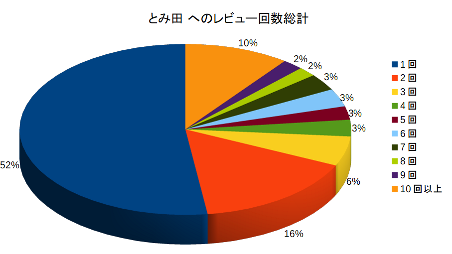

# ラーメンデータベースレポート Part.2

今回は店舗に対するレビュー数という観点で、いろいろ集計をしてみた。

# 店舗情報の集計

今回は、店舗情報に着目していくつかのデータを集計してみた。

また、レビュー数が非常に多い店舗に着目し、一見客が多いのか、ヘビーリピータが多いのかを調べた。

------

## 都道府県別のレビューされた店舗

2017年末までに登録されたレビューを元に、都道府県別にレビューされた店舗数を集計してみた。基本的に傾向としては、レビュー数の集計とそれほど変わらないはずだが、特定の店舗にレビューが集中している場合には、多少レビュー数でソートした場合と、異なる結果が出てくるかもしれない。

### サマリ

### 詳細

| 都道府県 | 店舗数 | 都道府県 | 店舗数 | 都道府県 | 店舗数 |
| -------- | ------ | -------- | ------ | -------- | ------ |
| 東京都   | 15670  | 京都府   | 948    | 愛媛県   | 217    |
| 神奈川県 | 6021   | 新潟県   | 874    | 三重県   | 215    |
| 埼玉県   | 3884   | 山形県   | 696    | 秋田県   | 208    |
| 千葉県   | 3216   | 山梨県   | 653    | 奈良県   | 171    |
| 大阪府   | 2849   | 広島県   | 604    | 大分県   | 169    |
| 茨城県   | 1976   | 岩手県   | 550    | 和歌山県 | 130    |
| 北海道   | 1872   | 山口県   | 511    | 鹿児島県 | 129    |
| 群馬県   | 1792   | 岐阜県   | 483    | 宮崎県   | 128    |
| 愛知県   | 1783   | 富山県   | 462    | 佐賀県   | 128    |
| 栃木県   | 1700   | 青森県   | 416    | 福井県   | 118    |
| 長野県   | 1399   | 石川県   | 350    | 鳥取県   | 118    |
| 福岡県   | 1196   | 沖縄県   | 346    | 高知県   | 108    |
| 福島県   | 1068   | 海外     | 322    | 徳島県   | 106    |
| 静岡県   | 1063   | 滋賀県   | 280    | 香川県   | 94     |
| 兵庫県   | 963    | 熊本県   | 238    | 長崎県   | 87     |
| 宮城県   | 954    | 岡山県   | 220    | 島根県   | 71     |

レビュー数で集計したほど顕著ではないが、レビューされた店舗数で集計した場合にも、首都圏に集中しているのが分かる。レビューされた全店舗の約半分が、東京都、神奈川県、埼玉県、千葉県の4都道府県で占められている。

------

## 多くレビューされた店舗

### 店舗ごとのレビュー数の分布

まず、店舗ごとのレビュー数の分布を示す。

レビュー数が1件しかない店舗は全体の1/3、レビュー数が10件までの店舗は80%。ほとんどの店舗がレビュー数が10件以内に留まっている。そして101件以上のレビューがあった店は、僅か2%に過ぎず、特定の店舗にレビューが集中していることが分かる。

更に101件以上のレビューを集めている（全体から見ると僅か2%！の）店舗に対するレビュー数を見てみる。

ほとんどの店は300レビュー以内だが、1000レビューを超えるようなとんでもない店も何軒か存在している。次の節でレビュー数トータルTOP 10を示す。

### 2017年末までのトータル TOP 10

2017年末までのレビュー数TOP 10の店舗を示す。

| 店舗名               | 場所                 | レビュー数 |
| -------------------- | -------------------- | ---------- |
| 中華蕎麦 とみ田      | 千葉県松戸市         | 1755       |
| 麺屋 一燈            | 東京都葛飾区         | 1594       |
| MENYA 食い味の道有楽 | 千葉県柏市           | 1558       |
| 狼煙 ～NOROSHI～     | 埼玉県さいたま市北区 | 1302       |
| 風雲児               | 東京都渋谷区         | 1219       |
| 麺屋吉左右           | 東京都江東区         | 1188       |
| 味噌麺処 花道        | 東京都中野区         | 1064       |
| ラーメン二郎三田本店 | 東京都港区           | 1056       |
| 中華そば 四つ葉      | 埼玉県比企郡         | 1032       |
| 燦燦斗               | 東京都北区           | 1023       |

上位3店舗の東京都北東部・千葉県西部の店舗へのレビュー数の多さは異様なほど。他に注目すべき店舗としては、埼玉県比企郡にある「中華そば 四つ葉」だ。繁華街とは思えない場所（自分は実際に行ったことはないので、実は繁華街だったらごめんなさい）にあるにも関わらず、これだけのレビュー数があるのは驚異。

店舗数としては東京に次ぐ神奈川県の店舗がないのは少々以外。（ただし「豚星。」の移転前/移転後を合算すると1400レビュー超となりTOP 4になる。

### 年別レビュー数TOP 10

2005年から2017年までの各年ごとに最もレビュー数を稼いだ店舗TOP 10を以下に示す。ここから、どういう傾向のラーメンの流行りがあったのかを見れるのではと思ったわけだが・・・。

| 年     | 1位                  | 2位                  | 3位                  | 4位                  | 5位                          | 6位                          | 7位                 | 8位                      | 9位                          | 10位                      |
| ------ | -------------------- | -------------------- | -------------------- | -------------------- | ---------------------------- | ---------------------------- | ------------------- | ------------------------ | ---------------------------- | ------------------------- |
| 2005年 | 藍嶌                 | 中華そば すずらん    | 麺屋武蔵新宿本店     | 中華そば べんてん    | らうめん つけめん 三都屋     | らーめん大大森店             | みの麺多            | なんつッ亭 弐品川店      | 渡なべ                       | 味噌蔵らーめん まるしゅう |
| 2006年 | 中華そば べんてん    | 中華ソバ 櫻坂        | 六厘舎本店           | 九段 斑鳩            | らーめん大大森店             | めん徳二代目つじ田御茶ノ水店 | 瞠池袋店            | 中華そば すずらん        | 麺屋武蔵新宿本店             | 渡なべ                    |
| 2007年 | 中華蕎麦 とみ田      | 六厘舎本店           | 麺屋吉左右           | ラーメン二郎小岩店   | めん徳二代目つじ田御茶ノ水店 |                              | こうかいぼう        | 麺処 井の庄              | 兎に角松戸店                 | 中華ソバ 櫻坂             |
| 2008年 | 風雲児               | 中華蕎麦 とみ田      | 本家大黒屋本舗平井店 | 麺屋吉左右           | めん徳二代目つじ田御茶ノ水店 | 六厘舎本店                   | 九段 斑鳩           | TETSU品川店              | 食処 渓                      | ラーメン二郎環七一之江店  |
| 2009年 | 中華蕎麦 とみ田      | 風雲児               | 大つけ麺博 2009      | 味噌麺処 花道        | らーめん豚喜                 | 麺屋吉左右                   | つけめん102大宮店   | 麺屋 えん寺              | ラーメン二郎ひばりヶ丘駅前店 | らぁめん 葉月             |
| 2010年 | 麺屋 一燈            | 中華蕎麦 とみ田      | MENYA 食い味の道有楽 | 風雲児               | らーめん豚喜                 | 俺の麺 春道                  | 六厘舎              | 麺屋 和利道 warito       | 燦燦斗                       | 丸直                      |
| 2011年 | 麺屋 一燈            | MENYA 食い味の道有楽 | 丸直                 | 燦燦斗               | 中華蕎麦 とみ田              | つけ麺 五ノ神製作所          | 狼煙 ～NOROSHI～    | 六厘舎                   | 麺処 ほん田東京駅一番街店    | はりけんラーメン          |
| 2012年 | 麺屋 一燈            | ラーメン燈郎         | ラーメンアキラ       | 麺屋 桐龍            | 狼煙 ～NOROSHI～             | 大つけ麺博 2012              | 麺や 蒼 AOI         | Japanese Soba Noodles 蔦 | MENYA 食い味の道有楽         | 喜元門つくば東光台店      |
| 2013年 | 豚星。               | ラーメンアキラ       | おおぜき中華そば店   | 麺屋 一燈            | 麺処 晴                      | 煮干中華ソバ 宮庵            | ラーメン燈郎        | 大つけ麺博 日本一決定戦2 | 狼煙 ～NOROSHI～             | MENYA 食い味の道有楽      |
| 2014年 | 豚星。               | 中華そば 四つ葉      | いのうえ             | ラーメン燈郎         | おおぜき中華そば店           | 麺屋 桐龍                    | 良温(Ra-on)         | 麺や 虎徹                | 丸直                         | 煮干中華ソバ イチカワ     |
| 2015年 | 中華そば よしかわ    | 中華そば 四つ葉      | 豚星。               | MENYA 食い味の道有楽 | 麺屋 扇 SEN                  | 特級鶏蕎麦 龍介              | 中華そば 飯村製作所 | 煮干しつけ麺 宮元        | 柳麺 呉田-goden-             | 良温(Ra-on)               |
| 2016年 | 寿製麺よしかわ川越店 | 豚星。               | さんじ               | 麺屋 桐龍            | 中華そば 四つ葉              | MENYA 食い味の道有楽         | 麺庵ちとせ          | 中華そば よしかわ        | 麺屋 扇 SEN                  | 特級鶏蕎麦 龍介           |
| 2017年 | 寿製麺よしかわ川越店 | 煮干乱舞             | さんじ               | 中華そば よしかわ    | 豚星。                       | MENYA 食い味の道有楽         | 麺庵ちとせ          | 八咫烏                   | 中華そば 四つ葉              | 麺屋 桐龍                 |

年毎のTOP 10を集計することで、ここ十数年のラーメンのトレンド（豚骨魚介→二郎系→あっさり系/煮干し系）という流れが見えてくるかとも思ったが、そこまではっきりはした結果ではない気がする。ブームに関わらず人気のある店が、このランキングには出てくるのでそれは仕方がないことか。こういうトレンドについては、レポートのPart 1で示したように、全レビューのスープ種別による集計のほうが納得感のある結果になっている。

トータルレビュー数でTOPに輝く「中華蕎麦 とみ田」もレビュー数に関しては、ここ数年はレビュー数TOP 10に入っていないのは意外であった。

二郎系の中では、直系店ではなくインスパイア店の「豚星。」が2013年以降、TOP 10に常にランクインしているのが興味深い。しかも途中で店舗移転がありながらのレビュー数である。直系にはない、様々な限定メニューを繰り出してリピータを呼んでいる効果なのか。

個人的には、都内にある「おおぜき中華そば店」「麺屋 一燈」「狼煙 ～NOROSHI～」「風雲児」、首都圏外の中核地方都市にある「中華蕎麦 とみ田」「豚星。」「MENYA 食い味の道有楽」、都市圏外の「中華そば 四つ葉」、これらの店舗にどういった形でレビューが集中しているのかが、興味がある。とりあえず、これらの店舗の年別レビュー数をプロットしてみた。

実は「狼煙 ～NOROSHI～」以外の店舗は、2015年以降、レビュー数が純減しているのは面白い。如何に人気のある店で合っても常に高いレビュー数をキープするのは難しいということか。もちろん、ラーメンのレビューをするという人間自体が奇特であるので、実際に来店している客については、どの店舗もそれほど減っているわけではないだろう。

しかし、ラーメンレビューをする人間というのは、来客数と比較するとそれほど多くはなさそうだし、同じようなラーメンの写真とレビューを上げ続ける信者はさらに少ないだろう。なので、人気店であってもレビュー数が減っていくのは仕方がないのかもしれない。

それはともかく、これらの店が、特定のレビューアが集中的にレビューをしているのか、それとも、不特定多数のレビューアーがレビューをしているのか、そのあたりを見てみるのも面白そうだ。

一部の店舗には「信者」といえるレビューアが存在するとしても、それは店舗の責任ではない（と思いたい。実は信者を優遇している店もあるかもしれないが）。いずれにせよ、信者の採点を除外してその店に行くかどうかを判断するほうが安全ではあると思う。

### 店舗ごとのレビュー傾向

#### 中華蕎麦 とみ田（千葉県松戸市）

## 

とみ田くらいの有名店になると、「とりあえず1回は行ってみなくては」というレビューアも多いのだろうが、2回以上訪問してレビューを上げるユーザは20%にしかすぎない。リピート率は意外に低いのだが、行列が酷いのだろうから、一回行けば十分という人が多いのかもしれない。

レビュー回数についても、一見ユーザのレビュー数が過半数を超えている。この店舗は信者によるレビュースコアへの影響が小さいとも言えそうだ。。

なお、自分は何時間も並ぶほど暇人ではないので、わざわざ松戸まで遠征して此処に行くことは多分、今後もなさそう。

#### 豚星。（横浜市神奈川区→川崎市中原区）

豚星。については、一見客が約60%（自分もレビューは1回だけしか上げていない）で、残り40%がリピーター。一部には100回を超えるレビューを上げているツワモノもおり、またヘビーリピーターの数が多いことから、レビュー数としてみると、レビュー回数が10回を超えるヘビーリピーターのレビューが全体の8割近くを占めている。

この店を評価するときには、ヘビーリピーターの採点を信用できるかどうかがポイントになりそうだ。

#### MENYA 食い味の道有楽（千葉県柏市）

ここは5ch(旧2ch)でも結構いろいろ言われていた店なので、どういったレビュー数分布になるのか、個人的には結構楽しみにしていた店舗である。

レビュー回数別にレビューアーを分類すると、

　

一見、少々リピート率が高い店、というようにも見えるが、実が5回以上レビューをしているユーザのレビュー数が半端ないのがこの店舗の特徴である（この店舗に50回以上レビューしているユーザが10名いることからも察してほしい）。

このグラフを見てもわかるように、この店舗への採点の実に85%がヘビーリピータのレビューで占められている。また、一見客のレビュー数の比率はわずか7%に過ぎない。こうしたヘビーレビューアーが信者なのか、それとも純粋に美味さを評価しているのかは、部外者からは判断できないが、この店への評価は、こうしたヘビーリピーターを信用するか否かで大きく変わってきそうだ。

なお、ここへは一度食べに行った（ラーメンを食べる前に飲んでいたのでポリシーに従いレビューはしていない）が、実際美味いラーメンだとは思えた。

### 麺屋 一燈（東京都葛飾区）

麺屋一燈はヘビーリピーターで支えられているという先入観があったのだが、こうしてみると意外にも一見客・ライトなリピーターが多いことがわかった。

レビュー回数総計で見ても、ヘビーリピーターによるレビュー数は全体の40%で、予想したよりは高くない。一見客や数回程度のライトなリピーターのレビューも多いので、思ったよりは信者臭の薄い店のようだ。

------

## おわりに

今回は店舗に対するレビュー数という観点でいろいろ調べてみた。とりあえず思ったこと。

- 結局、ラーメンデータベースは首都圏ラーメンデータベースでしかないこと。
- 人気店舗は、ヘビーリピーターを抱えていること。
- そのヘビーリピーターのレビューにより店舗の平均点が左右される割合が大きそう。

今回の集計の中でヘビーリピーターについて触れたが、次回はステマユーザと、それを仕掛けた店舗のあぶり出しをやってみようと思う。